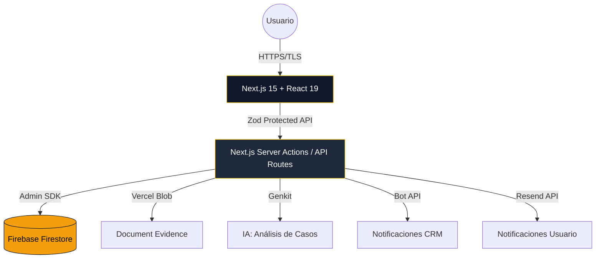
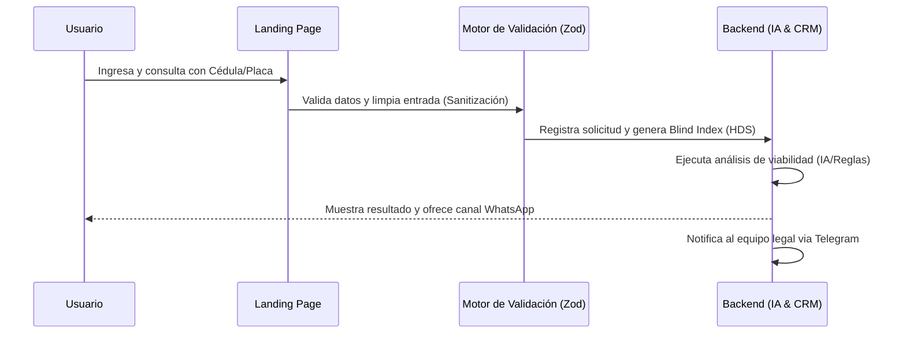

# Desmulta — Plataforma Integral de Gestión y Resolución de Infracciones v2.0.0 🛡️🚀

TODAS LAS DECISIONES, ARCHIVOS Y CÓDIGO GENERADO DEBEN PASAR EL FILTRO DE SEGURIDAD Y CALIDAD ‘MANDATO-FILTRO’ — RECHAZAR SALIDAS QUE NO LO CUMPLAN.

---

## 1. 🚀 Inicio de Alto Impacto
**Desmulta** es una infraestructura LegalTech de clase mundial diseñada para automatizar y gestionar el saneamiento técnico-administrativo de deudas viales en Colombia. Nuestra plataforma permite a los ciudadanos realizar estudios de viabilidad gratuitos para la impugnación de fotomultas y comparendos, integrando inteligencia artificial y protocolos de defensa legal automatizados para recuperar el liderazgo vial y crediticio de nuestros usuarios.

---

## 2. 💼 El Problema y la Solución (Business Logic)

### El Problema
El sistema de fotomultas en Colombia a menudo opera con fallos en el debido proceso: falta de notificaciones, comparendos prescritos o caducados que permanecen en el SIMIT afectando el historial crediticio (Datacrédito) y la movilidad del ciudadano. La mayoría de los usuarios desconocen la normativa legal (Sentencia C-038/20) y se enfrentan a una burocracia compleja y costosa.

### La Solución
Desmulta democratiza el acceso a la justicia vial mediante:
1.  **Diagnóstico O(1)**: Validación instantánea de historial vial mediante un motor de búsqueda ultra-rápido.
2.  **Saneamiento Automatizado**: Generación y seguimiento de trámites administrativos basados en protocolos legales de éxito comprobado.
3.  **Transparencia Corporativa**: El usuario recibe un acta de viabilidad técnica antes de cualquier compromiso económico.

---

## 3. 🏗️ Arquitectura del Sistema (System Architecture)

Nuestra arquitectura está diseñada bajo principios de **Modularidad Estricta** y **Zero-Trust Security**.



*   **Frontend**: Next.js 15 con React 19 para un renderizado híbrido optimizado. Interfaz construida con Tailwind CSS y componentes de alta fidelidad.
*   **Backend / DB**: Firebase como núcleo de persistencia en tiempo real. Se implementó **Firebase Admin SDK** para operaciones privilegiadas, garantizando que el cliente nunca tenga acceso de escritura directo a datos sensibles.
*   **Seguridad Activa**: Implementación de CSP (Content Security Policy) restrictiva, HDS (Habeas Data Security) y validación de entrada con Zod.

---

## 4. 🧭 Flujo del Usuario (User Journey)

El recorrido del usuario está optimizado para la conversión y la seguridad legal.



1.  **Ingreso**: El usuario accede a la Landing Page y se autentica de forma anónima y segura.
2.  **Consulta**: Sube su historial del SIMIT o ingresa datos de infracción.
3.  **Procesamiento**: El sistema valida la viabilidad legal (prescripción o caducidad).
4.  **Resolución**: Se genera un caso interno y se notifica al usuario el camino técnico a seguir.

---

## 5. 📂 Estructura del Código (Folder Structure)

```plaintext
├── /public           # Assets, logos, manifest PWA y recursos estáticos
├── /src
│   ├── /app          # Rutas principales (Next.js App Router) y API endpoints
│   ├── /components   # UI Components (Secciones, botones, formularios)
│   ├── /firebase     # Configuración y proveedores de Firebase Client/Admin
│   ├── /hooks        # Lógica de negocio extraída (Scroll, Reveal, Mouse)
│   ├── /lib          # Utilidades core, validadores Zod, Logger y Seguridad
│   └── /services     # Capa de servicios para integraciones externas (Gemini, Telegram)
├── firestore.rules   # Reglas de seguridad de base de datos
└── package.json      # Dependencias y control de versiones (v2.0.0)
```

---

## 6. 📊 Modelo de Base de Datos (Data Model)

A continuación, la estructura de las colecciones principales en Firestore:

*   **Colección `consultations`**:
    *   `shortId`: ID secuencial para seguimiento (CASO-001).
    *   `cedula`: Identificación del usuario (Ofuscado en logs).
    *   `nombre` / `contacto`: Información de comunicación.
    *   `status`: [pendiente, en_proceso, finalizado, anulado].
    *   `evidenceUrl`: Referencia a la captura o documento legal.
*   **Colección `consultas_index`**:
    *   `hashId` (PK): SHA-256 de la cédula para búsquedas ultra-rápidas sin exponer PII.
*   **Colección `site_config`**:
    *   Almacena datos dinámicos de la UI (Showcase, testimonios).

---

## 7. 🚀 Trabajo a Futuro (Roadmap)

Desmulta no se detiene; nuestra visión a corto plazo incluye:
*   **Integración de Pasarela de Pago**: Pagos directos de honorarios de éxito vía PSE/Stripe.
*   **Dashboard de Usuario Pro**: Panel de seguimiento en tiempo real del estado jurídico de cada proceso.
*   **IA OCR Avanzada**: Lectura automática de PDF de comparendos para extracción de errores de forma.
*   **WhatsApp Bot 2.0**: Respuestas automatizadas basadas en el estado del caso en Firestore.

---

**Desmulta © 2026 — Ingeniería de Clase Mundial para la Justicia Vial. Hecho por un equipo Senior.**
