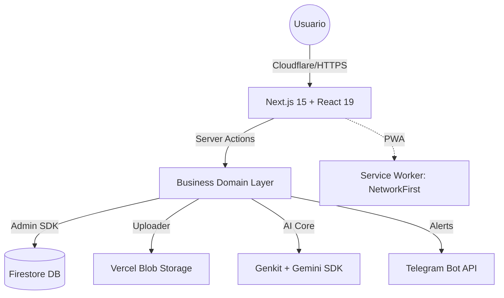

# Desmulta — Plataforma Integral de Gestión y Resolución de Infracciones v2.3.8 🛡️🚀

**Infraestructura de Clase Mundial para la Justicia Vial en Colombia.**

> [!IMPORTANT]
> TODAS LAS DECISIONES, ARCHIVOS Y CÓDIGO GENERADO DEBEN PASAR EL FILTRO DE SEGURIDAD Y CALIDAD ‘MANDATO-FILTRO’ — RECHAZAR SALIDAS QUE NO LO CUMPLAN.

---

## 1. 🚀 Visión General
**Desmulta** es una solución LegalTech de alto impacto que automatiza el diagnóstico y saneamiento de deudas de tránsito. Mediante el uso de Inteligencia Artificial y protocolos administrativos precisos, permitimos que el ciudadano recupere su libertad financiera y vial frente a fotomultas e infracciones injustas.

---

## 2. 🛡️ Capacidades Core del Sistema

### 📋 Módulos de Operación
1.  **Estudio de Viabilidad Técnica**: Formulario inteligente de 3 pasos que analiza la probabilidad de éxito (Prescripción, Caducidad o Fallos de Notificación).
2.  **Captura Rápida SIMIT**: Flujo optimizado para usuarios móviles que permite subir una captura del SIMIT y recibir asesoría instantánea vía WhatsApp.
3.  **Admin Dashboard v2.3.7**: Panel de control senior para la gestión de leads, estadísticas en tiempo real y supervisión de evidencias.

### 🧠 Inteligencia & CRM
-   **Análisis con Genkit AI**: Integración nativa con Google Gemini para el pre-análisis de casos complejos.
-   **Notificaciones CRM**: Sistema de alertas automáticas vía **Telegram Bot** para el equipo jurídico ante nuevos registros.
-   **Sincronización Dinámica**: Actualización instantánea del frontend mediante *Server Actions* e invalidación de caché optimizada.

### 🔒 Seguridad de Nivel Bancario (Zero-Trust)
-   **Shield Anti-Bot**: Implementación combinada de **Cloudflare Turnstile** (modo Managed) y **Honeypot dinámico**. El botón de envío se mantiene bloqueado hasta la validación exitosa.
-   **Precisión en Rate Limiting**: Límites por IP y UID con retroalimentación exacta en minutos/segundos (consultas) u horas/minutos (imágenes) para evitar abusos.
-   **Privacidad por Diseño**: Motor de auditoría `SecurityLogger` que ofusca datos de identificación (PII) en todos los logs de consola y servidor.
-   **Hardening de Headers**: CSP (Content Security Policy) estricta implementada en el Middleware para mitigar ataques XSS y Clickjacking.

---

## 🏗️ 3. Arquitectura Técnica



### Stack Tecnológico
-   **Framework**: Next.js 15.5.12 (App Router).
-   **Frontend**: React 19, Tailwind CSS, Framer Motion, GSAP, Radix UI.
-   **Backend**: Server Actions, API Routes (Edge Runtime ready), Zod Validation.
-   **Base de Datos**: Firebase Firestore (Estrategia Singleton para Admin SDK).
-   **Almacenamiento**: Vercel Blob con sistema de limpieza automática vía Cron.
-   **PWA**: Soporte offline completo con `@ducanh2912/next-pwa` y manifest optimizado.

---

## 📂 4. Estructura del Proyecto

```plaintext
├── /public           # Assets, manifest PWA y Service Worker v2.3.7
├── /src
│   ├── /app          # Rutas, API Endpoints y Server Actions (Capa de Negocio)
│   ├── /components   # UI Dinámica (Vial-Clear & Primitives)
│   ├── /lib          # Core Logic: Schemas, Loggers, Env-Check, Security Headers
│   ├── /services     # Capa de Integración (Firebase, Telegram, Gemini)
│   ├── /hooks        # Lógica de estado y notificaciones (Toast)
│   └── /tests        # Suite de pruebas Unitarias y de Integración con Vitest
```

---

## 🛠️ 5. Configuración y Despliegue

### Variables de Entorno Requeridas (.env)
El sistema requiere una configuración estricta para operar bajo el MANDATO-FILTRO:

| Variable | Propósito |
| :--- | :--- |
| `NEXT_PUBLIC_FIREBASE_API_KEY` | Cliente Firebase Web |
| `FIREBASE_PRIVATE_KEY` | Autenticación Admin SDK (Server Side) |
| `NEXT_PUBLIC_TURNSTILE_SITE_KEY` | Key pública de Cloudflare Turnstile |
| `TURNSTILE_SECRET_KEY` | Validación Server-side de Turnstile |
| `GEMINI_API_KEY` | Motor de IA para análisis de casos |
| `TELEGRAM_BOT_TOKEN` | Token para notificaciones de leads |
| `NEXT_PUBLIC_WHATSAPP_NUMBER` | Canal de contacto principal |

### Ciclo de Desarrollo
1.  **Instalación**: `npm install`
2.  **Ejecución**: `npm run dev` (Puerto 9005)
3.  **Calidad**: `npm run lint` && `npm run typecheck`
4.  **Pruebas**: `npm run test`
5.  **Producción**: `npm run build`

---

## 📊 6. SEO & Rendimiento
-   **Indexación Estratégica**: `sitemap.xml` dinámico para todas las variantes de servicios por ciudad.
-   **Web Vitals**: Optimización de tipografía (Outfit) y carga diferida para garantizar LCP < 1.2s.
-   **Accesibilidad**: Cumplimiento de estándares ARIA en todos los componentes interactivos.

---

**Desmulta © 2026 — Ingeniería de Clase Mundial para la Justicia Vial. Hecho por un equipo Senior.**
