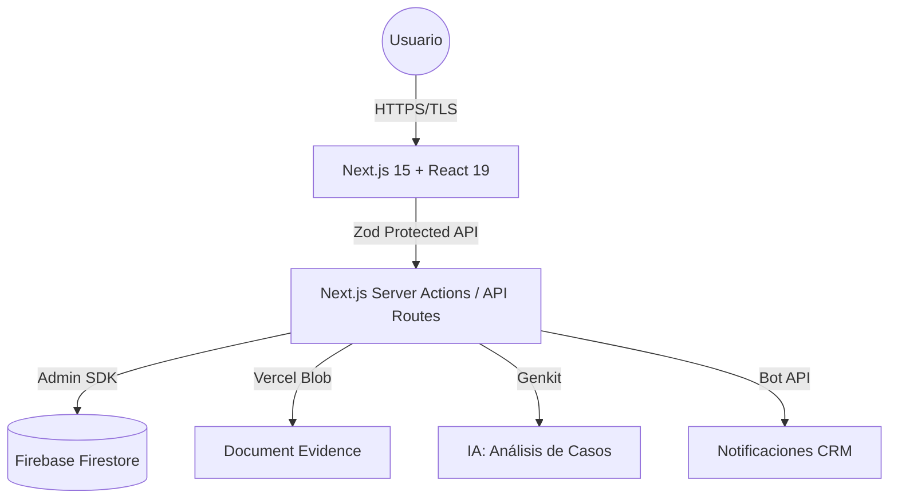

# Desmulta — Plataforma Integral de Gestión y Resolución de Infracciones v2.3.7 🛡️🚀

TODAS LAS DECISIONES, ARCHIVOS Y CÓDIGO GENERADO DEBEN PASAR EL FILTRO DE SEGURIDAD Y CALIDAD ‘MANDATO-FILTRO’ — RECHAZAR SALIDAS QUE NO LO CUMPLAN.

---

## 1. 🚀 Inicio de Alto Impacto

**Desmulta** es una infraestructura LegalTech de clase mundial diseñada para automatizar y gestionar el saneamiento técnico-administrativo de deudas viales en Colombia. Nuestra plataforma permite a los ciudadanos realizar estudios de viabilidad gratuitos para la impugnación de fotomultas y comparendos, integrando inteligencia artificial y protocolos de defensa legal automatizados para recuperar el liderazgo vial y crediticio de nuestros usuarios.

---

## 2. 💼 El Problema y la Solución

### El Problema

El sistema de fotomultas en Colombia a menudo opera con fallos en el debido proceso: falta de notificaciones, comparendos prescritos o caducados que permanecen en el SIMIT afectando el historial crediticio (Datacrédito) y la movilidad del ciudadano.

### La Solución

Desmulta democratiza el acceso a la justicia vial mediante:

1.  **Diagnóstico O(1)**: Validación instantánea de historial vial.
2.  **Saneamiento Automatizado**: Generación de trámites basados en protocolos de éxito.
3.  **Sincronización Dinámica**: Panel administrativo que actualiza estadísticas e imágenes globalmente en tiempo real.

---

## 3. 🏗️ Arquitectura del Sistema

Nuestra arquitectura está diseñada bajo principios de **Modularidad Estricta** y **Zero-Trust Security**.



- **Frontend**: Next.js 15 con React 19 y empaquetado PWA optimizado.
- **Backend / DB**: Firebase Admin SDK para operaciones seguras desde el servidor.
- **Seguridad Activa**: CSP restrictiva, Ofuscación PII en logs y Normalización de Llaves Privadas.
- **Sincronización**: Uso de `revalidatePath` para actualizaciones instantáneas de caché.

---

## 4. 📂 Estructura del Código

```plaintext
├── /public           # Assets, logos, manifest PWA y Service Worker (v2.3.7)
├── /src
│   ├── /app          # Rutas principales y Server Actions (Sincronización Dinámica)
│   ├── /components   # UI Components de Alta Fidelidad
│   ├── /firebase     # Configuración y proveedores (Client/Admin)
│   ├── /lib          # Utilidades core, Logger de Seguridad y Constantes Neutras
│   └── /services     # Capa de servicios e integraciones externas
```

---

## 5. 📊 Innovaciones Recientes (v2.3.7)

- **Optimización PWA & SW**: Consolidación de un único Service Worker (`sw.js`) eliminando registros redundantes. Implementación de estrategia `NetworkFirst` para documentos, garantizando que el usuario siempre vea la versión más reciente sin bloqueos de caché.
- **Sincronización de Estadísticas**: Refactorización a _Server Actions_ para permitir que los cambios en el Administrador se reflejen al instante en la web pública mediante invalidación de caché on-demand.
- **Blindaje Firebase**: Nuevo motor de normalización de llaves RSA para garantizar estabilidad 99.9% en infraestructuras Edge (Vercel).
- **Consistencias Neutras**: Desacoplamiento de constantes en `config-constants.ts` para evitar fugas de Node.js al navegador.

---

**Desmulta © 2026 — Ingeniería de Clase Mundial para la Justicia Vial. Hecho por un equipo Senior.**
