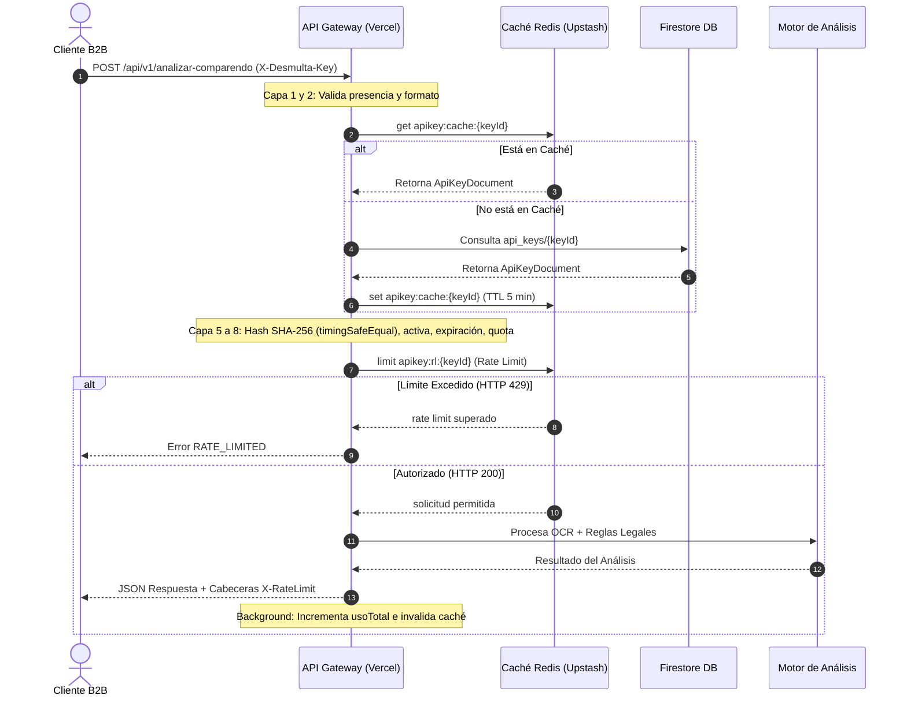

# ⚡ Referencia Técnica y Operativa de la API B2B — Desmulta

Esta guía documenta la arquitectura, el funcionamiento, los endpoints y el manual operativo de la **API B2B de Desmulta**. Actualmente, el motor de procesamiento y la capa de seguridad (API Gateway) se encuentran completamente desarrollados y desplegados en producción en la rama `main`, pero la API está **inactiva a nivel comercial** (no se ofrece al público general ni tiene interfaces de autoservicio). 

Este documento sirve como manual de referencia técnica para cuando se decida activar comercialmente el servicio.

---

## 1. Resumen de Arquitectura (API Gateway)

La API B2B expone los servicios centrales del motor legal de Desmulta (cálculo financiero y análisis estructurado con OCR) mediante endpoints REST protegidos por un Gateway de 9 capas de seguridad diseñado con una filosofía **Fail-Closed** (denegación de acceso inmediata ante fallas de infraestructura).



### Las 9 Capas de Seguridad del Guard (`api-key-guard.ts`)
1. **Presencia de Cabecera:** Verifica que el header `X-Desmulta-Key` esté presente y tenga una longitud mínima de 20 caracteres.
2. **Formato Estricto:** Comprueba que la key empiece con el prefijo `dm_live_` o `dm_test_`.
3. **Caché de Llaves (Redis):** Intenta recuperar el documento de la key desde Upstash Redis (TTL de 5 minutos). Esto evita golpear la base de datos Firestore en el 95% de las peticiones concurrentes.
4. **Respaldo en Base de Datos (Firestore):** Si la clave no está en caché, consulta el documento en la colección `api_keys` usando la clave como ID de documento.
5. **Comparación en Tiempo Constante (Timing-Safe):** Calcula el hash SHA-256 de la key provista y lo compara con el hash almacenado en la base de datos utilizando `timingSafeEqual` del módulo `crypto` de Node.js. Esto mitiga ataques de canal lateral basados en la medición de tiempos de respuesta.
6. **Verificación de Estado Activo:** Valida que la propiedad `activa` de la key sea `true`.
7. **Verificación de Expiración:** Comprueba si la fecha actual es anterior al campo `expiresAt` (si está configurado).
8. **Control de Cuota Mensual:** Compara el uso del mes actual (`usoMesActual`) contra el límite mensual definido para el plan contratado.
9. **Limitador de Tasa por Minuto (Upstash):** Aplica un rate limit deslizante (sliding window) por minuto específico para cada plan.

> [!IMPORTANT]
> **Seguridad Criptográfica y Privacidad:**
> - **Cero texto plano:** La API Key real en texto plano nunca se almacena en la base de datos. Solo se guarda su hash criptográfico SHA-256.
> - **Clave efímera:** La clave completa se expone en la respuesta JSON del endpoint administrativo **una sola vez** al momento de su creación. Si el cliente la pierde, debe ser revocada y se debe emitir una nueva.

---

## 2. Planes y Límites

El sistema soporta tres planes de suscripción preconfigurados. Los contadores mensuales se resetean de forma atómica el día 1 de cada mes mediante transacciones de base de datos.

| Plan | Límite Mensual | Límite por Minuto | Tarifa Sugerida | Propósito |
| :--- | :--- | :--- | :--- | :--- |
| **starter** | 500 solicitudes | 10 solicitudes | COP $150.000 / mes | Integraciones pequeñas o pruebas piloto. |
| **growth** | 5.000 solicitudes | 30 solicitudes | COP $450.000 / mes | Empresas medianas, bufetes medianos o flotas pequeñas. |
| **enterprise** | 50.000 solicitudes | 100 solicitudes | Contrato Anual | Grandes operadores de logística o fintechs. |

---

## 3. Endpoints de la API B2B

Todos los endpoints B2B se encuentran agrupados bajo la ruta `/api/v1/*`. Requieren obligatoriamente la cabecera `X-Desmulta-Key`.

### 3.1. POST `/api/v1/calcular-multa`
Calcula el dictamen de viabilidad legal y el desglose de intereses/ahorro financiero a partir de los datos numéricos de una infracción. **No procesa imágenes ni requiere uso de OCR.**

#### Payload de Entrada (JSON)
```json
{
  "valorMulta": 654400,
  "fechaInfraccion": "2022-04-18",
  "tieneCobroCoactivo": false,
  "textoOCR": "Opcional. Texto extraído previamente que puede ayudar a afinar causales."
}
```

- `valorMulta` (Número, Obligatorio): Valor nominal de la infracción en pesos colombianos.
- `fechaInfraccion` (String, Obligatorio): Fecha de la infracción en formato `YYYY-MM-DD`.
- `tieneCobroCoactivo` (Booleano, Opcional, default `false`): Si la secretaría ya notificó el mandamiento de pago coactivo (amplía el horizonte de prescripción a 6 años).
- `textoOCR` (String, Opcional): Texto plano adicional para enriquecer el dictamen legal.

#### Respuesta de Ejemplo (JSON - HTTP 200 OK)
```json
{
  "success": true,
  "analisisLegal": {
    "estado": "PRESCRITO",
    "estadoUI": "PRESCRITO",
    "isViable": true,
    "tiempoTranscurrido": "4 años y 2 meses",
    "diasTotales": 1522,
    "porcentajeCaducidad": 100,
    "dictamenTecnico": "Esta multa cumple con los requisitos del Art. 159 del CNT para ser declarada prescrita.",
    "causalesAplicables": [
      {
        "id": "prescripcion_general",
        "titulo": "Prescripción General de la Acción de Cobro",
        "articulo": "Artículo 159 de la Ley 769 de 2002 (Código Nacional de Tránsito)",
        "descripcion": "La acción de cobro de las multas de tránsito prescribe a los tres (3) años de la ocurrencia del hecho infraccional."
      }
    ]
  },
  "financiero": {
    "deudaNominal": 654400,
    "interesesMora": 284120,
    "deudaTotalProyectada": 938520,
    "costoDesmulta": 150000,
    "ahorroProyectado": 788520,
    "descuentoPorcentaje": 84,
    "formulaAplicada": "Liquidación calculada usando el SMMLV vigente y la tasa legal colombiana."
  },
  "_meta": {
    "plan": "starter",
    "remainingMonth": 498,
    "remainingMinute": 9
  }
}
```

---

### 3.2. POST `/api/v1/analizar-comparendo`
Recibe una imagen de comparendo codificada en base64, realiza la extracción estructurada mediante IA y ejecuta los motores de cálculo en una sola llamada. **Procesamiento 100% en memoria (no almacena archivos físicos).**

#### Payload de Entrada (JSON)
```json
{
  "imageBase64": "data:image/jpeg;base64,/9j/4AAQSkZJR...",
  "mimeType": "image/jpeg"
}
```

- `imageBase64` (String, Obligatorio): Cadena de la imagen en base64 (límite máximo de 4MB).
- `mimeType` (String, Obligatorio): Debe ser uno de: `image/jpeg`, `image/png` o `image/webp`.

#### Respuesta de Ejemplo (JSON - HTTP 200 OK)
```json
{
  "success": true,
  "ocr": {
    "modoEstructurado": true,
    "confianza": 95,
    "texto": "REPUBLICA DE COLOMBIA\nSECRETARIA DE MOVILIDAD DE BOGOTA\nCOMPARENDO No. 110010000000234567..."
  },
  "comparendo": {
    "numeroComparendo": "110010000000234567",
    "fechaInfraccion": "15/03/2021",
    "placa": "AAA123",
    "codigoInfraccion": "C35",
    "descripcionInfraccion": "No realizar la revisión técnico-mecánica...",
    "valorMulta": 454260,
    "nombreInfractor": "JUAN PEREZ",
    "cedulaInfractor": "1018234567",
    "entidadEmisora": "Secretaría de Movilidad de Bogotá",
    "ciudad": "Bogotá",
    "esFotomulta": true,
    "tieneCobroCoactivo": false,
    "tieneMandamientoPago": false,
    "tieneResolucionSancionatoria": true,
    "fechaResolucion": "20/08/2021"
  },
  "analisisLegal": {
    "estado": "PRESCRITO",
    "isViable": true,
    "tiempoTranscurrido": "5 años y 3 meses",
    "diasTotales": 1920,
    "dictamenTecnico": "Comparendo con resolución sancionatoria del 20/08/2021 sin mandamiento de pago coactivo notificado...",
    "causales": [
      {
        "id": "prescripcion_sancion",
        "titulo": "Prescripción de la Sanción Vial",
        "articulo": "Artículo 159 del Código Nacional de Tránsito",
        "descripcion": "Habiendo resolución sancionatoria en firme, la secretaría tenía 3 años desde su expedición para iniciar el cobro coactivo."
      }
    ]
  },
  "financiero": {
    "deudaNominal": 454260,
    "interesesMora": 198400,
    "deudaTotalProyectada": 652660,
    "costoDesmulta": 120000,
    "ahorroProyectado": 532660,
    "descuentoPorcentaje": 81
  },
  "_meta": {
    "plan": "growth",
    "remainingMonth": 4850,
    "remainingMinute": 28
  }
}
```

#### Cabeceras HTTP de Respuesta
Los endpoints B2B responden con dos cabeceras personalizadas de control de consumo para facilitar la gestión del cliente:
- `X-RateLimit-Remaining-Month`: Peticiones mensuales restantes para el periodo de facturación actual.
- `X-RateLimit-Remaining-Minute`: Peticiones por minuto restantes para el minuto en curso.

---

## 4. Respuestas de Error Estandarizadas

Las respuestas de error de Desmulta devuelven un código HTTP acorde y un cuerpo JSON tipado bajo la interfaz `ApiErrorBody`. El frontend o backend del cliente B2B debe validar la propiedad `code` en lugar del texto del error.

```json
{
  "code": "RATE_LIMITED",
  "message": "Demasiadas solicitudes por minuto. Tu plan starter permite 10 req/min. Espera unos segundos."
}
```

| Código de Error (`code`) | Código HTTP | Causa / Descripción |
| :--- | :---: | :--- |
| `API_KEY_MISSING` | 401 | No se incluyó la cabecera `X-Desmulta-Key` en la petición. |
| `API_KEY_INVALID` | 401 | La API Key no existe en Firestore o no coincide con su hash SHA-256. |
| `API_KEY_REVOKED` | 403 | La API Key fue desactivada administrativamente (`activa: false`). |
| `API_KEY_EXPIRED` | 403 | Se superó la fecha límite configurada en el campo `expiresAt`. |
| `API_KEY_QUOTA_EXCEEDED` | 429 | El cliente superó el cupo de requests mensuales asignados a su plan. |
| `RATE_LIMITED` | 429 | Se superaron las solicitudes por minuto permitidas para su plan. |
| `VALIDATION_ERROR` | 400 | El cuerpo JSON está mal estructurado o fallaron las validaciones de esquema (Zod). |
| `INVALID_DOCUMENT` | 422 | (Solo OCR) La imagen enviada no contiene palabras clave de multas de tránsito. |
| `OCR_TIMEOUT` | 503 | (Solo OCR) El procesamiento de la imagen en Gemini excedió el tiempo límite de 20s. |
| `INTERNAL_ERROR` | 500 | Error no controlado o caída interna en el procesamiento del servidor. |

---

## 5. CRUD de Administración de API Keys

Para gestionar el ciclo de vida de las API Keys, existe el endpoint `/api/admin/api-keys`. Este recurso está protegido bajo dos filtros de seguridad:
1. **Autenticación Firebase Admin:** El cliente debe estar logueado y enviar un token JWT válido de Firebase en la cookie `__session`.
2. **Lista Blanca de Administradores:** El email del usuario autenticado debe estar presente en la variable de entorno `ADMIN_EMAILS` (cadena separada por comas).

### 5.1. GET `/api/admin/api-keys`
Lista las API Keys registradas en el sistema para auditoría y control de consumo.

**Respuesta (HTTP 200 OK):**
```json
{
  "success": true,
  "total": 1,
  "keys": [
    {
      "keyId": "dm_live_58c2b74fa1492bcf747120a2bf4ad36f9872e4...",
      "nombre": "Concesionario AutoBogotá",
      "email": "tecnologia@autobogota.com.co",
      "plan": "growth",
      "activa": true,
      "creadaEn": "2026-06-18T12:00:00.000Z",
      "expiresAt": null,
      "usoTotal": 1240,
      "usoMesActual": 320,
      "mesActual": "2026-06",
      "ultimoUso": "2026-06-18T17:15:32.122Z",
      "quotaDelPlan": {
        "requestsPerMonth": 5000,
        "requestsPerMinute": 30
      }
    }
  ]
}
```

### 5.2. POST `/api/admin/api-keys`
Genera una nueva API Key criptográfica de 256 bits y almacena su hash SHA-256 de forma irreversible.

**Payload de Entrada (JSON):**
```json
{
  "nombre": "Fintech Movilidad SAS",
  "email": "integraciones@fintechmovilidad.com",
  "plan": "growth",
  "expiresAt": "2027-06-18T23:59:59.000Z",
  "notaAdmin": "Acuerdo comercial de API piloto por 1 año"
}
```

**Respuesta (HTTP 201 Created):**
```json
{
  "success": true,
  "mensaje": "⚠️ GUARDA ESTA KEY AHORA. No podrás verla de nuevo. Si la pierdes, deberás revocar y crear una nueva.",
  "apiKey": "dm_live_58c2b74fa1492bcf747120a2bf4ad36f9872e41122334455",
  "keyId": "dm_live_58c2b74fa1492bcf747120a2bf4ad36f9872e41122334455",
  "plan": "growth",
  "quotaDelPlan": {
    "requestsPerMonth": 5000,
    "requestsPerMinute": 30
  },
  "expiresAt": "2027-06-18T23:59:59.000Z"
}
```

### 5.3. DELETE `/api/admin/api-keys`
Revoca y bloquea de manera inmediata el acceso de una API Key. Modifica su estado en base de datos a `activa: false` e invalida el caché Redis en tiempo real.

**Payload de Entrada (JSON):**
```json
{
  "keyId": "dm_live_58c2b74fa1492bcf747120a2bf4ad36f9872e41122334455"
}
```

**Respuesta (HTTP 200 OK):**
```json
{
  "success": true,
  "mensaje": "API Key revocada correctamente. El acceso queda bloqueado de forma inmediata."
}
```

---

## 6. Guía de Activación en Vivo (Go-Live)

Cuando se decida lanzar la comercialización de la API B2B de Desmulta, se deben completar los siguientes pasos operativos y de infraestructura en el orden indicado para evitar interrupciones o bloqueos inesperados del servicio.

---

### 6.1. Requisitos de Facturación y Cuotas de Infraestructura

El API Gateway está diseñado bajo una filosofía **Fail-Closed** (si un servicio crítico como la base de datos o el limitador de tasa falla, el acceso se deniega por seguridad). Por ende, es obligatorio actualizar las cuentas de infraestructura de desarrollo a planes de producción con facturación activa antes de habilitar clientes de pago.

#### A. Google AI Studio (Gemini API)
El modelo `gemini-2.5-flash` se encarga de la extracción estructurada del comparendo mediante OCR en el endpoint `/api/v1/analizar-comparendo`.
*   **El Riesgo de la Capa Gratuita:** AI Studio restringe la capa gratuita a límites muy bajos de peticiones por minuto (RPM) y peticiones por día (RPD) (ej. 15 RPM). Si varios clientes consumen la API de forma concurrente, el servicio de Google responderá con un error HTTP 429 de cuota excedida y el Gateway de Desmulta fallará devolviendo `OCR_TIMEOUT` o `INTERNAL_ERROR`.
*   **Acción de Activación:**
    1.  Ingresar a la consola de [Google AI Studio](https://aistudio.google.com/).
    2.  Ir a la sección **Billing** (Facturación) en el menú lateral.
    3.  Hacer clic en **Set up billing** (Configurar facturación) y enlazar un proyecto activo de Google Cloud Console.
    4.  En la consola de Google Cloud, asociar una tarjeta de crédito o método de pago válido para habilitar el plan de pago por uso (**Pay-as-you-go**).
    5.  Esto removerá los límites gratuitos, elevando la cuota disponible (hasta 1,000+ RPM) y garantizando que cada llamada de OCR se procese con prioridad y sin bloqueos de tasa de uso.

#### B. Upstash Redis (Caché y Rate Limiting)
El API Gateway utiliza Upstash Redis como motor de alta velocidad para almacenar el caché de validación de las llaves (`apikey:cache:{keyId}`) y para llevar el control del Rate Limiter deslizante por minuto de cada cliente.
*   **El Riesgo de la Capa Gratuita:** El tier gratuito de Upstash Redis tiene un límite estricto de **10,000 comandos por día**. Dado que cada petición a la API B2B realiza múltiples operaciones en Redis (por ejemplo, 1 consulta de lectura para verificar caché + 1 consulta para el rate limiter + incrementos/alertas adicionales en background), la cuota gratuita puede agotarse por completo con tan solo 2,000 a 3,000 peticiones de API reales en un día.
*   **Consecuencia Crítica (Fail-Closed):** Si Upstash alcanza su límite, empezará a rechazar todas las llamadas HTTP. Dado el flujo de seguridad en `api-key-guard.ts`, cualquier excepción de Redis en el bloque de Rate Limit causará que la función deniegue el acceso devolviendo `valid: false` con un error `RATE_LIMITED` falso o un error general de API, bloqueando inmediatamente a todos los clientes activos.
*   **Acción de Activación:**
    1.  Iniciar sesión en la consola de [Upstash](https://console.upstash.com/).
    2.  Seleccionar la base de datos Redis que utiliza el entorno de producción.
    3.  Ir a la pestaña **Billing** (Facturación).
    4.  Registrar una tarjeta de crédito o método de pago de la empresa.
    5.  Actualizar la base de datos al plan **Pay-as-you-go** (pago por uso) o un plan fijo mensual según la proyección de tráfico. El costo básico por uso es sumamente bajo (aproximadamente USD $0.20 por cada 100,000 comandos), lo cual previene sobrecostos y elimina por completo el límite diario de 10k comandos.

---

### 6.2. Configuración de Variables de Entorno en Producción (Vercel)

Asegurarse de configurar las variables de entorno en el panel administrativo del proyecto en Vercel para el entorno de producción (`Production`). Ninguna credencial de producción debe estar escrita en código fuente o archivos locales.

*   `ADMIN_EMAILS`: Dirección o lista de correos separados por comas de las personas autorizadas para acceder a `/admin/api-keys` y gestionar claves. (Ej: `operaciones@desmulta.com,gerencia@desmulta.com`).
*   `UPSTASH_REDIS_REST_URL` y `UPSTASH_REDIS_REST_TOKEN`: La URL REST y el Token del cluster de Upstash Redis con facturación Pay-as-you-go ya activa.
*   `GEMINI_API_KEY`: La clave de API de Google AI Studio que cuenta con facturación enlazada a Google Cloud.
*   `FIREBASE_ADMIN_CREDENTIALS`: El JSON codificado en Base64 de la cuenta de servicio de Firebase (Service Account) con permisos de lectura/escritura en la base de datos de producción de Firestore.

---

### 6.3. Manual de Operación: Emisión y Control de Claves

Una vez que la infraestructura está lista y configurada con planes de pago, el flujo operativo para dar de alta a un nuevo cliente comercial es el siguiente:

#### Paso 1: Autenticación Administrativa
Dado que el endpoint de creación `/api/admin/api-keys` requiere una sesión válida de Firebase con rol administrativo en la cookie `__session`:
1.  El operador autorizado debe iniciar sesión en el panel web administrativo de Desmulta (`/login` o `/admin`).
2.  El navegador almacenará de forma segura la cookie `__session` (HTTPOnly y Secure).
3.  Todas las llamadas administrativas subsiguientes desde el panel incluirán automáticamente la cookie para autorizar la transacción en el backend.

#### Paso 2: Generación del Token Comercial
El administrador puede utilizar la interfaz visual del panel administrativo (`/admin/api-keys`) haciendo clic en **"Generar Nueva API Key"** o ejecutar un script autorizado.

**Comando de Generación Alternativo (cURL):**
```bash
curl -X POST https://desmulta.online/api/admin/api-keys \
  -H "Content-Type: application/json" \
  -H "Cookie: __session=<token-jwt-sesion-firebase>" \
  -d '{
    "nombre": "Concesionario AutoBogotá",
    "email": "contacto@autobogota.com.co",
    "plan": "growth"
  }'
```

**Respuesta Exitosa (HTTP 201 Created):**
```json
{
  "success": true,
  "mensaje": "⚠️ GUARDA ESTA KEY AHORA. No podrás verla de nuevo. Si la pierdes, deberás revocar y crear una nueva.",
  "apiKey": "dm_live_58c2b74fa1492bcf747120a2bf4ad36f9872e41122334455",
  "keyId": "dm_live_58c2b74fa1492bcf747120a2bf4ad36f9872e41122334455",
  "plan": "growth",
  "quotaDelPlan": {
    "requestsPerMonth": 5000,
    "requestsPerMinute": 30
  },
  "expiresAt": null
}
```

> [!WARNING]
> **Entrega de Claves:**
> - Copie la propiedad `apiKey` completa del JSON de respuesta y envíela al cliente final a través de un canal seguro y cifrado (como un gestor de secretos o chat seguro de un solo uso).
> - Esta es la **única vez** en que se muestra la clave completa. El sistema de base de datos solo almacena el hash criptográfico SHA-256 de forma irreversible para prevenir filtraciones masivas de datos en caso de accesos no autorizados a Firestore.

#### Paso 3: Consumo por parte del Cliente B2B
El cliente B2B debe incluir su clave de API en la cabecera `X-Desmulta-Key` en cada petición REST que realice a los endpoints de producción.

**Ejemplo de Petición del Cliente (cURL):**
```bash
curl -X POST https://desmulta.online/api/v1/calcular-multa \
  -H "Content-Type: application/json" \
  -H "X-Desmulta-Key: dm_live_58c2b74fa1492bcf747120a2bf4ad36f9872e41122334455" \
  -d '{
    "valorMulta": 654400,
    "fechaInfraccion": "2023-01-10",
    "tieneCobroCoactivo": true
  }'
```

#### Paso 4: Monitoreo y Auditoría de Uso
1.  El administrador puede supervisar el consumo acumulado de solicitudes llamando periódicamente al endpoint `GET /api/admin/api-keys` (o consultando la tabla de claves en el panel administrativo).
2.  En la base de datos Firestore, se puede auditar de forma granular el campo `usoMesActual` para cada documento dentro de la colección `api_keys` para controlar la facturación mensual.
3.  El límite mensual de cuota se restablecerá de forma automática el primer día de cada mes al ocurrir la primera petición de la API, gracias a una transacción atómica que detecta el cambio de mes e inicializa el contador `usoMesActual` en 1.
4.  Si un cliente no paga su mensualidad, se puede revocar el acceso de forma instantánea llamando al endpoint administrativo con el método `DELETE`, lo cual cambiará el estado de la llave en Firestore a `activa: false` e invalidará la entrada en caché de Redis para cortar las peticiones subsiguientes de inmediato.
