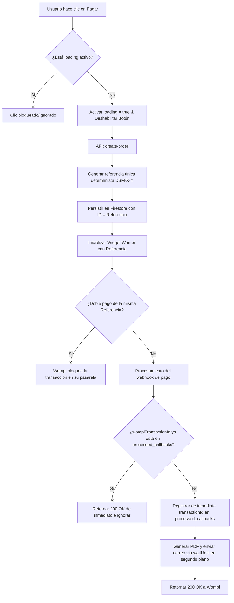

# Idempotencia y Seguridad contra Doble Transacción en Desmulta

Este documento detalla la arquitectura de seguridad, control de concurrencia y políticas de idempotencia implementadas en la plataforma **Desmulta** para evitar cobros duplicados, transacciones redundantes, o envío repetido de Derechos de Petición cuando un usuario presiona repetidamente los botones de envío o de pago.

---

## 1. Prevención de Doble Clic en el Frontend (Capa UI/UX)

La primera barrera de defensa reside en el navegador del usuario. El objetivo es interceptar y neutralizar clics sucesivos (causados por impaciencia, frustración o fallos del mouse) antes de que generen peticiones de red.

### A. Formulario de Consulta SIMIT (`ConsultationForm.tsx`)
En el flujo principal de carga de comparendos y registro de leads:
* **Estado de Control Local (`isFormProcessing`):** Al ejecutarse el manejador de envío (`onSubmit`), el estado `isFormProcessing` se establece inmediatamente en `true`.
* **Intercepción Temprana:** La primera línea de la lógica de envío valida este estado:
  ```typescript
  if (isFormProcessing) return;
  ```
  Si se detecta un clic posterior mientras la petición previa está activa, la función aborta silenciosamente.
* **Deshabilitación Física del Botón:** El botón de envío se deshabilita visualmente utilizando la propiedad HTML nativa `disabled={isSubmitting || isFormProcessing}`. Esto previene que el navegador registre eventos de clic adicionales en la interfaz.

### B. Formulario de Pago y Generación de PDF (`src/app/documentos/generador/[slug]/page.tsx`)
En el flujo de checkout y compra del Derecho de Petición:
* **Estado `loading`:** Al presionar el botón "Pagar y Descargar PDF", el estado local `loading` cambia de inmediato a `true`.
* **Deshabilitación del Botón:** El botón de pago renderiza un indicador de carga animado (`Loader2`) y se deshabilita mediante `disabled={loading}`.
* **Neutralización de Clics:** Al estar deshabilitado nativamente, el navegador no emite más eventos `onClick={handlePay}` hacia la función manejadora.

---

## 2. Idempotencia en la Creación de Órdenes (Capa API de Pago)

Si un cliente lograra evadir la protección del frontend, el backend de Desmulta aplica idempotencia estricta en la generación de transacciones con la pasarela de pagos.

### A. Referencia Única Determinista (`create-order/route.ts`)
Cada solicitud de checkout en el endpoint `/api/payments/create-order` genera un identificador de referencia único global (`wompiReference`):
```typescript
const wompiReference = `DSM-${shortId}-${timestamp}`;
```
Este identificador se compone del ID único del caso y la marca de tiempo exacta de la solicitud inicial.

### B. Persistencia E Idempotency Key en Firestore
* La orden de compra se persiste en Firestore utilizando la `wompiReference` como el **ID del documento** en la colección correspondiente.
* Se almacena explícitamente el campo `idempotencyKey` mapeado a esta referencia única.
* Si el cliente intenta recrear o re-enviar la misma orden, Firestore rechazará la escritura duplicada si se intenta crear una nueva entrada con el mismo ID, o bien se actualizará de forma segura la orden existente en lugar de duplicarla.

### C. Restricción en la Pasarela Wompi
La `wompiReference` generada es la que se envía como parámetro `reference` al inicializar el **Widget Checkout de Wompi**:
```javascript
const checkout = new WidgetCheckout({
  currency: 'COP',
  amountInCents: data.amountCop,
  reference: data.wompiReference,
  publicKey: data.publicKey,
  signature: { integrity: data.signature },
});
```
La pasarela de pagos Wompi tiene la regla estricta de no procesar dos transacciones diferentes con la misma referencia de pago (`reference`). Si un usuario intenta pagar la misma referencia que ya está aprobada o en proceso, Wompi denegará la transacción automáticamente en sus servidores, eliminando el riesgo de dobles cobros en tarjetas de crédito o cuentas bancarias.

---

## 3. Idempotencia en el Procesamiento de Pagos (Capa Backend Webhook)

El riesgo más crítico en sistemas de pago es la recepción duplicada de notificaciones (webhooks). Las pasarelas de pago reintentan el envío del webhook si el servidor de destino no responde a tiempo o si hay micro-cortes de red, lo que podría provocar la generación duplicada de PDFs o múltiples envíos de correos electrónicos.

### A. El Registro de Confirmaciones (`webhook-wompi/route.ts`)
Desmulta implementa un sistema de idempotencia de nivel empresarial en el receptor del webhook:
1. **Identificador de Transacción de Wompi:** Cada pago confirmado por la pasarela cuenta con un identificador de transacción único propio de Wompi (`wompiTransactionId` o `transactionId`).
2. **Validación Duplicada en Base de Datos:** Antes de procesar el webhook, el servidor consulta la colección de Firestore `processed_callbacks` utilizando el `transactionId` único de Wompi como ID del documento:
   ```typescript
   const callbackRef = db.collection('processed_callbacks').doc(transactionId);
   const callbackDoc = await callbackRef.get();
   ```
3. **Descarte Silencioso:** Si el documento ya existe, el webhook se clasifica como duplicado y el servidor aborta el procesamiento de inmediato:
   ```typescript
   if (callbackDoc.exists) {
     logger.info('[webhook-wompi] Webhook duplicado ignorado', { transactionId });
     return NextResponse.json({ status: 'ignored', reason: 'duplicate' }, { status: 200 });
   }
   ```
   **Importante:** Se devuelve un código HTTP `200 OK` para informarle a la pasarela que el mensaje fue recibido correctamente, deteniendo así la ráfaga de reintentos automáticos.

### B. Mitigación de Condiciones de Carrera (Race Conditions)
Si dos peticiones webhook idénticas llegaran exactamente al mismo milisegundo (condición de carrera), ambas podrían pasar la validación `callbackDoc.exists` al mismo tiempo si la base de datos se consulta en paralelo antes de escribir.

Para mitigar esto, Desmulta aplica la técnica de **registro de estado temprano**:
* **Escritura Previa:** El documento en `processed_callbacks` se crea **antes** de iniciar cualquier tarea pesada, asíncrona o externa (como la llamada al motor de generación de PDF o el envío del correo electrónico mediante `resend`).
* **Bloqueo Atómico:** Al escribirse la transacción en Firestore al inicio del flujo, cualquier petición paralela que consulte la base de datos una fracción de segundo después detectará inmediatamente la existencia del registro de confirmación y se detendrá, impidiendo la duplicidad de la lógica de negocio.
* **Procesamiento en Background Asíncrono Seguro:** La entrega del PDF al correo se delega mediante `waitUntil()` de `@vercel/functions`, lo que mantiene el ciclo de vida de la función activo en Vercel de forma controlada pero desacoplada de la respuesta inmediata del webhook, garantizando el retorno rápido de HTTP 200 hacia la pasarela.

---

## Resumen del Flujo de Protección


