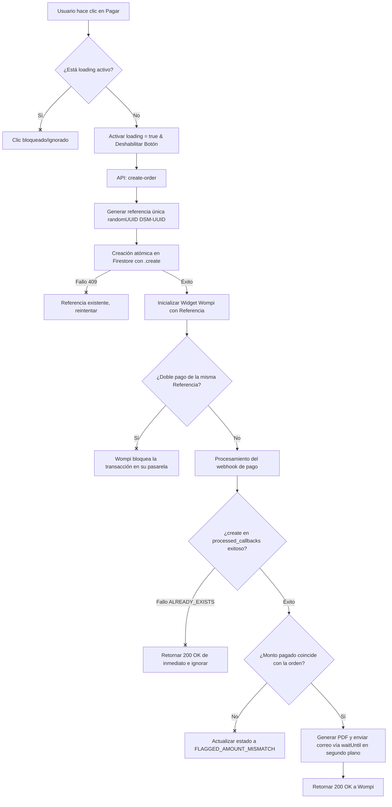

# Idempotencia y Seguridad contra Doble Transacción en Desmulta

Este documento detalla la arquitectura de seguridad, control de concurrencia y políticas de idempotencia implementadas en la plataforma **Desmulta** para evitar cobros duplicados, transacciones redundantes, o envío repetido de Derechos de Petición cuando un usuario presiona repetidamente los botones de envío o de pago.

---

## 1. Prevención de Doble Clic en el Frontend (Capa UI/UX)

La primera barrera de defensa reside en el navegador del usuario. El objetivo es interceptar y neutralizar clics sucesivos (causados por impaciencia, frustración o fallos del mouse) antes de que generen peticiones de red.

### A. Formulario de Consulta SIMIT (`ConsultationForm.tsx`)
En el flujo principal de carga de comparendos y registro de leads:
* **Estado de Control Local (`isFormProcessing`):** Al ejecutarse el manejador de envío (`onSubmit`), el estado `isFormProcessing` se establece inmediatamente en `true`.
* **Intercepción Temprana:** La primera línea de la lógica de envío valida este estado:
  ```typescript
  if (isFormProcessing) return;
  ```
  Si se detecta un clic posterior mientras la petición previa está activa, la función aborta silenciosamente.
* **Deshabilitación Física del Botón:** El botón de envío se deshabilita visualmente utilizando la propiedad HTML nativa `disabled={isSubmitting || isFormProcessing}`. Esto previene que el navegador registre eventos de clic adicionales en la interfaz.

### B. Formulario de Pago y Generación de PDF (`src/app/documentos/generador/[slug]/page.tsx`)
En el flujo de checkout y compra del Derecho de Petición:
* **Estado `loading`:** Al presionar el botón "Pagar y Descargar PDF", el estado local `loading` cambia de inmediato a `true`.
* **Deshabilitación del Botón:** El botón de pago renderiza un indicador de carga animado (`Loader2`) y se deshabilita mediante `disabled={loading}`.
* **Neutralización de Clics:** Al estar deshabilitado nativamente, el navegador no emite más eventos `onClick={handlePay}` hacia la función manejadora.
* **`src/app/documentos/generador/[slug]/page.tsx`**: Botón de firma deshabilitado inmediatamente al hacer clic + toast de carga para prevenir el envío doble de contratos.

---

## 2. Idempotencia en la Creación de Órdenes (Capa API de Pago)

El backend (`src/app/api/payments/create-order/route.ts`) es la barrera final y más estricta. Implementa una llave de idempotencia criptográfica:

### A. Fingerprinting Determinista (SHA-256)
Para asegurar que una misma intención de compra no genere dos enlaces de pago diferentes (lo que duplicaría cobros si el usuario lograba doble clic extremo), el backend genera un hash combinando estrictamente datos deterministas:
- `Cédula del Infractor`
- `Tipo de Producto` (ej. Derecho de Petición General)

> [!WARNING]  
> **Bug Histórico (Julio 2026):** Originalmente, el hash incluía un `shortId` generado en el cliente con `Date.now()`. Esto rompía el determinismo: dos clics separados por milisegundos tenían `shortId` diferentes, burlando la idempotencia. Esto fue solucionado eliminando el timestamp del hash.

### B. Ventana de Idempotencia Temporal
Antes de insertar la orden en Firebase, se ejecuta una consulta con bloqueo implícito:
```typescript
const prevOrder = await purchasesRef
  .where('idempotencyKey', '==', idempotencyKey)
  .where('createdAt', '>', OneHourAgo)
  .where('status', '==', 'PENDING')
  .limit(1)
  .get();
```
Si existe una orden generada en la última hora, **se devuelve exactamente el mismo `wompiReference` y Link de Pago original**, abortando la creación. Esto hace imposible que Desmulta exponga al cliente a un doble cobro para la misma solicitud, cumpliendo con estándares transaccionales bancarios.

Si un cliente lograra evadir la protección del frontend, el backend de Desmulta aplica idempotencia estricta en la generación de transacciones con la pasarela de pagos.

### A. Referencia Única de Alta Entropía (`create-order/route.ts`)
Cada solicitud de checkout en el endpoint `/api/payments/create-order` genera un identificador de referencia único global (`wompiReference`) de alta entropía:
```typescript
const wompiReference = `DSM-${randomUUID()}`;
```
Este identificador no es predecible ni colisionable, lo que garantiza que dos solicitudes concurrentes nunca compartan el mismo ID de referencia.

### B. Persistencia e Idempotencia Atómica en Firestore
* La orden de compra se persiste en Firestore utilizando la `wompiReference` como el **ID del documento** en la colección correspondiente.
* Se almacena explícitamente el campo `idempotencyKey` mapeado a esta referencia única.
* Para evitar sobrescribir una orden existente si se diera una colisión de clave, el servidor realiza una escritura **atómica** utilizando `.create()` sobre Firestore en lugar de `.set()`:
  ```typescript
  try {
    await purchaseRef.create({ ...datosDeLaOrden... });
  } catch (err: unknown) {
    const code = (err as { code?: number })?.code;
    if (code === 6 /* ALREADY_EXISTS */) {
      return NextResponse.json({ error: 'Referencia en conflicto, reintenta.' }, { status: 409 });
    }
    throw err;
  }
  ```
  Esto garantiza que Firestore rechace cualquier escritura duplicada devolviendo un código 409 Conflict.

### C. Restricción en la Pasarela Wompi
La `wompiReference` generada es la que se envía como parámetro `reference` al inicializar el **Widget Checkout de Wompi**:
```javascript
const checkout = new WidgetCheckout({
  currency: 'COP',
  amountInCents: data.amountCop,
  reference: data.wompiReference,
  publicKey: data.publicKey,
  signature: { integrity: data.signature },
});
```
La pasarela de pagos Wompi tiene la regla estricta de no procesar dos transacciones diferentes con la misma referencia de pago (`reference`). Si un usuario intenta pagar la misma referencia que ya está aprobada o en proceso, Wompi denegará la transacción automáticamente en sus servidores, eliminando el riesgo de dobles cobros en tarjetas de crédito o cuentas bancarias.

---

## 3. Idempotencia en el Procesamiento de Pagos (Capa Backend Webhook)

El riesgo más crítico en sistemas de pago es la recepción duplicada de notificaciones (webhooks). Las pasarelas de pago reintentan el envío del webhook si el servidor de destino no responde a tiempo o si hay micro-cortes de red, lo que podría provocar la generación duplicada de PDFs o múltiples envíos de correos electrónicos.

### A. El Registro de Confirmaciones Atómico (`webhook-wompi/route.ts`)
Desmulta implementa un sistema de idempotencia de nivel empresarial en el receptor del webhook:
1. **Identificador de Transacción de Wompi:** Cada pago confirmado por la pasarela cuenta con un identificador de transacción único propio de Wompi (`wompiTransactionId` o `transactionId`).
2. **Validación Duplicada Atómica en Base de Datos:** En lugar de ejecutar una secuencia vulnerable de consulta (`get()`) seguida de escritura (`set()`) que deja abierta una ventana de carrera, el webhook realiza una inserción atómica usando `.create()` sobre la colección `processed_callbacks`:
   ```typescript
   try {
     await callbackRef.create({
       wompiTransactionId: transactionId,
       processedAt: FieldValue.serverTimestamp(),
       result: status,
     });
   } catch (err: unknown) {
     const code = (err as { code?: number })?.code;
     if (code === 6 /* ALREADY_EXISTS */) {
       logger.info('[webhook-wompi] Webhook duplicado ignorado (atómico)', { transactionId });
       return NextResponse.json({ ok: true, duplicate: true });
     }
     throw err;
   }
   ```
3. **Descarte Silencioso:** Si la inserción atómica falla por duplicidad (código 6 `ALREADY_EXISTS`), el servidor aborta el procesamiento de inmediato y retorna un código HTTP `200 OK` de confirmación de recepción para detener el reenvío de webhooks por parte de Wompi.

### B. Mitigación de Condiciones de Carrera (Race Conditions)
Al usarse `.create()` directamente como la primera instrucción sobre `processed_callbacks`, el bloqueo de base de datos se ejecuta en una única operación atómica indivisible. Cualquier petición duplicada paralela que llegue en la misma ventana de milisegundos recibirá de inmediato la excepción de duplicado de Firestore y será descartada de forma segura antes de despachar el PDF.

Adicionalmente, se ejecuta una validación de monto antes de continuar:
```typescript
const amountConfirmadoPorWompi = Number(transaction.amount_in_cents);
if (amountConfirmadoPorWompi !== purchase.amountCop) {
  logger.security('[webhook-wompi] 🚨 DISCREPANCIA DE MONTO', { reference, amountConfirmadoPorWompi });
  await purchaseRef.update({ status: 'FLAGGED_AMOUNT_MISMATCH' });
  return NextResponse.json({ ok: true, flagged: true });
}
```
Esto anula por completo la inyección de órdenes baratas para adquirir productos caros. El envío del PDF se delega mediante `waitUntil()` de `@vercel/functions` en segundo plano.

---

## Resumen del Flujo de Protección


